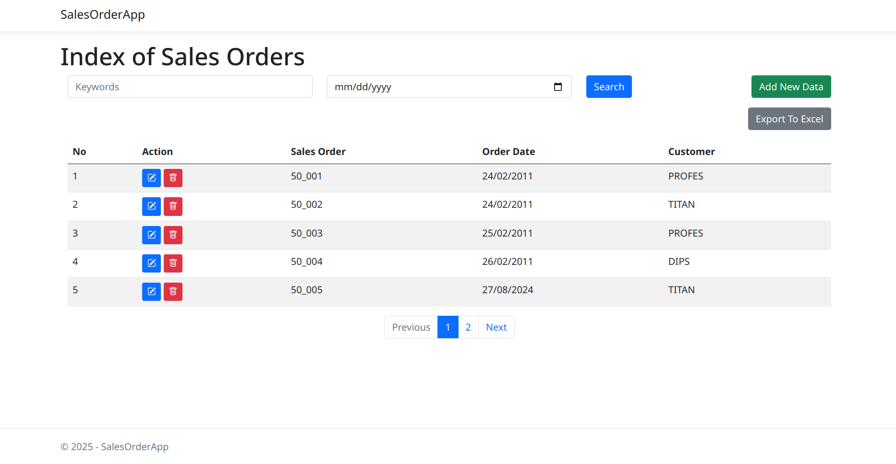
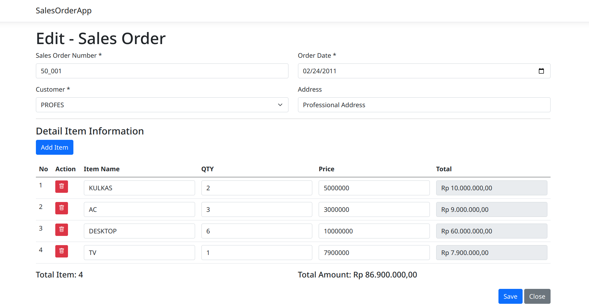

# 📦 Sales Order App

**Sales Order App** is a web-based documentation and management system for handling sales orders efficiently. Built with ASP.NET Core Razor Pages and Entity Framework Core, it allows users to create, search, edit, and export sales order data with an intuitive UI and backend logic.

---

## 🚀 Features

- 📄 **Sales Order Management**  
  Create, edit, and delete sales orders and associated line items.

- 🔍 **Smart Search**  
  Search by order number, customer name, or order date.

- 📅 **Date Filtering**  
  Quickly filter orders by specific dates.

- 📤 **Export to Excel**  
  Download the current order list in `.xlsx` format using ClosedXML.

- 📊 **Pagination**  
  Easily navigate through large datasets.

- 🛡️ **Client-Side Confirmation**  
  SweetAlert2 is used for confirming deletions and providing user feedback.

---

## 🛠️ Technologies Used

- **ASP.NET Core Razor Pages**
- **Entity Framework Core**
- **ClosedXML** for Excel export
- **Bootstrap 5** for styling
- **SweetAlert2** for popups
- **Microsoft SQL Server** for EF backend

---

## 📚 Project Structure

### Pages

- `/Orders/Index.cshtml`  
  Displays a searchable and paginated list of sales orders.

- `/Orders/Edit.cshtml`  
  Allows adding or editing orders with line items and customer information.

### Backend Logic

- `IndexModel.cs`  
  Handles filtering, pagination, and export logic.

- `Edit.cshtml.cs`  
  Handles form data binding, line item operations, and order save logic.

### Models

- `SO_ORDER`  
  Represents the main sales order.

- `SO_ITEM`  
  Represents individual line items within an order.

- `COM_CUSTOMER`  
  Represents customer data.

---

## 📦 How to Use

1. **View Orders**  
   Navigate to `/Orders`. Use the search form to filter.

2. **Create a New Order**  
   Click the "Add New Data" button to open the entry form.

3. **Edit or Delete Orders**  
   Use the edit ✏️ or delete 🗑️ buttons next to each order.

4. **Export to Excel**  
   Click the "Export to Excel" button to download current data.

5. **Line Item Handling**  
   Add/remove items dynamically in the edit view with live total calculations.

---

## 📷 Screenshots




---

## 🧪 Local Setup

1. **Clone the Repo**

   ```bash
   git clone https://github.com/your-username/sales-order-app.git
